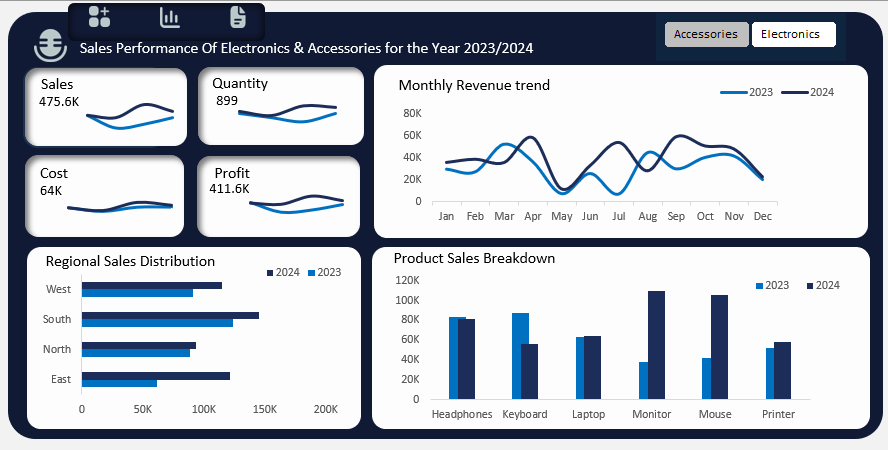

This project analyzes sales data to provide insights on product performance, regional sales trends, and profitability.

## Data Cleaning Steps
- Standardized date formats (YYYY-MM-DD)
- Corrected capitalization for Product, Category, and Region
- Converted Sales, Quantity, and Cost to numeric values
- Derived columns: Total Sales = Quantity × Sales, Profit = Sales - Cost

## Key Insights (Optional)
- Highest sales by product, region, or category
- Profit analysis per order
- Monthly/quarterly sales trends
